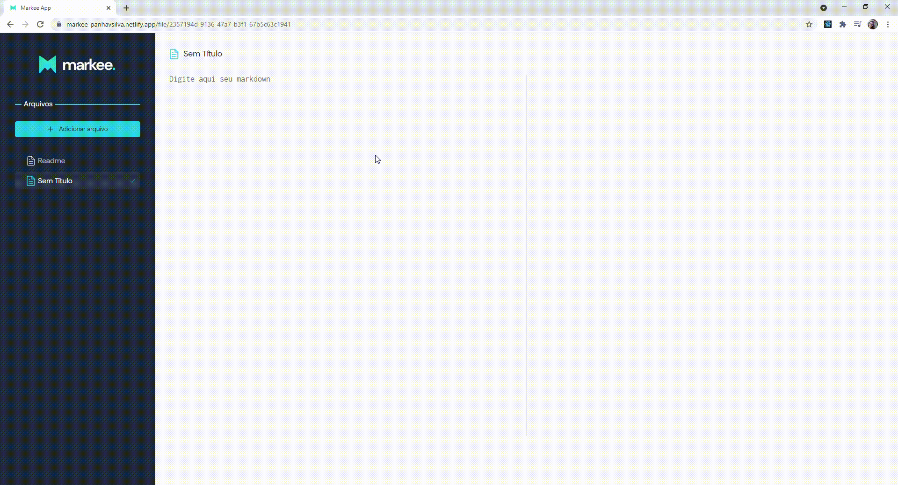

# Markee App
<div align='center'>
  
</div>
<br/>

### [💻 Acesse aqui](https://markee-panhavsilva.netlify.app/)
<br/>

# Indice

- 📂 [Sobre o Projeto](#📂-sobre-o-projeto)
- 👨‍💻️ [Tecnologias utilizadas](#👨‍💻️-tecnologias-utilizadas)
- 📦️ [Como utilizar o projeto](#📦️-como-utilizar-o-projeto)
<br/><br/>

## 📂 Sobre o projeto
**Markee App** é um editor de Markdown com visualização automática de seu resultado em HTML, desenvolvido durante o [Bootcamp de ReactJS da B.Academy](https://b-academy.brainn.co/).


<br/><br/>

## 👨‍💻️ Tecnologias utilizadas
- ReactJS
- TypeScript
- Styled Components
- LocalForage
- Marked
- Highlight.js
- Husky
- ESLint
- EditorConfig

### IDE
- [Visual Studio Code](https://code.visualstudio.com/)
<br/><br/>

## 📦️ Como utilizar o projeto

Para copiar o projeto, utilize os comandos:
```bash
  # Clonar o repositório
  ❯ git clone  https://github.com/panhavsilva/markee-app
  # Entrar no diretório
  ❯ cd markee-app
``` 
## 🔥 Executando a aplicação no seu terminal
```bash
  #install the dependencies
  yarn start
  #or
  npm 

  #start the server
  npm run dev
  # or
  yarn dev
```
Abra em seu navegador [http://localhost:3000](http://localhost:3000).
<br/><br/>

## ✨ Mostre seu apoio

Dê uma ⭐ se esse projeto te ajudou ou se você gostou!
